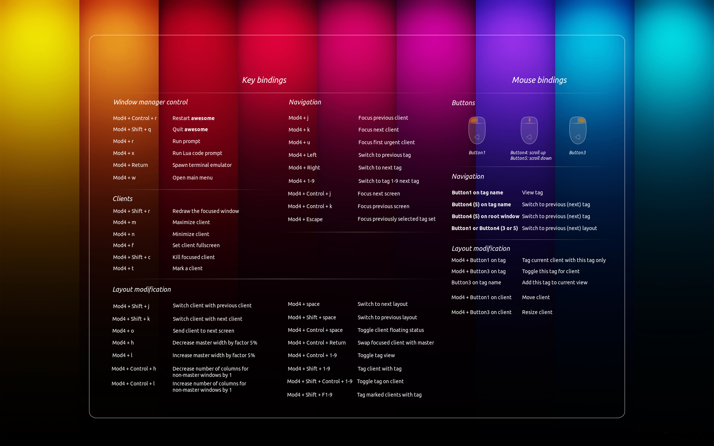

# Awesome WM Cheat Sheet

**cheat sheet wallpaper**

## Key Bindings

**Window manager control**

| Key binding        | Function        |
|--------------------|-----------------|
| Mod4 + Control + r | Restart awesome |
| Mod4 + Shift + q   | Quit awesome    |
| Mod4 + r           | Run prompt      |
| Mod4 + x           | Run Lua code prompt |
| Mod4 + Return      | Spawn terminal emulator |
| Mod4 + w           | Open main menu  |

**Navigation**

| Key binding        | Function        |
|--------------------|-----------------|
| Mod4 + j           | Focus next client |
| Mod4 + k           | Focus previous client |
| Mod4 + u           | Focus first urgent client |
| Mod4 + Left        | View previous tag |
|  Mod4 + Right      | View next tag |
| Mod4 + 1-9         | Switch to tag 1-9 |
| Mod4 + Control + j | Focus next screen |
| Mod4 + Control + k | Focus previous screen |
| Mod4 + Escape      | Focus previously selected tag set |

**Clients**

| Key binding        | Function        |
|--------------------|-----------------|
| Mod4 + Shift + r   | Redraw the focused window |
| Mod4 + m           | Maximize client |
| Mod4 + n           | Minimize client |
| Mod4 + f           | Set client fullscreen |
| Mod4 + Shift + c   | Kill focused client |
| Mod4 + t           | Mark a client |

**Layout modification**

| Key binding        | Function        |
|--------------------|-----------------|
| Mod4 + Shift + j   | Switch client with next client |
| Mod4 + Shift + k   | Switch client with previous client |
| Mod4 + o           | Send client to next screen |
| Mod4 + h           | Decrease master width factor by 5% |
| Mod4 + l           | Increase master width factor by 5% |
| Mod4 + Shift + h   | Increase number of master windows by 1 |
| Mod4 + Shift + l   | Decrease number of master windows by 1 |
| Mod4 + Control + h | Increase number of columns for non-master windows by 1 |
| Mod4 + Control + l | Decrease number of columns for non-master windows by 1 |
| Mod4 + space       | Switch to next layout |
| Mod4 + Shift + space | Switch to previous layout |
| Mod4 + Control + space | Toggle client floating status |
| Mod4 + Control + Return | Swap focused client with master |
| Mod4 + Control + 1-9    | Toggle tag view |
| Mod4 + Shift + 1-9      | Tag client with tag |
| Mod4 + Shift + Control + 1-9 | Toggle tag on client |
| Mod4 + Shift + F1-9     | Tag marked clients with tag |

### Mouse Bindings

**Navigation**

| Key binding        | Function    |
|--------------------|-------------|
| Button1 on tag name|   View tag. |
| Button4, Button5 on tag name | Switch to previous or next tag|
| Button4, Button5 on root window | Switch to previous or next tag|
| Button1, Button3, Button4, Button5 on layout symbol| Switch to previous or next layout|

**Layout modification**

| Key binding        | Function    |
|--------------------|-------------|
| Mod4 + Button1 on tag name | Tag current client with this tag only |
| Mod4 + Button3 on tag name | Toggle this tag for client |
| Button3 on tag name        | Add this tag to current view |
| Mod4 + Button1 on client window | Move window |
| Mod4 + Button3 on client window | Resize window |
